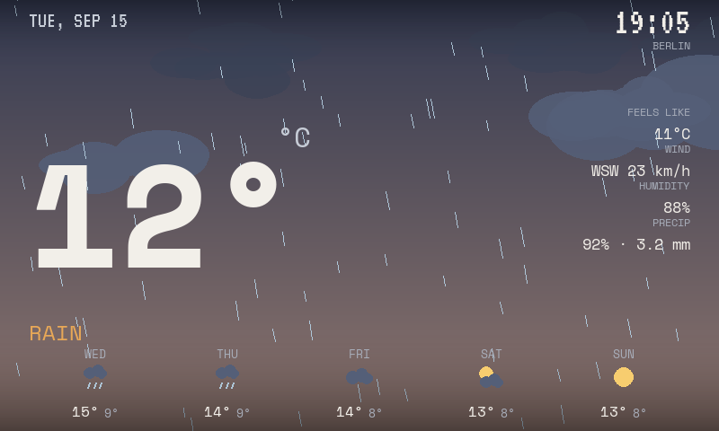

# weathr-panel

A small graphical weather appliance for a 7" Linux display — what
[weathr](https://github.com/Veirt/weathr)'s terminal ASCII scene might have
become if it had been designed for a pixel-addressable display instead of a
terminal grid.



Python 3 + Pygame(-ce), rendering straight to DRM/KMS or a Linux framebuffer
— no X11, Wayland, Chromium, Electron, Qt, or GTK.

## Design principles carried over from weathr

Studied weathr's README and Rust source (`src/theme`, `src/scene/world`,
`src/weather`, `src/animation_manager.rs`, `src/app_state.rs`) before writing
any rendering code. What's worth preserving:

- **The scene *is* the UI.** weathr has no dashboard — a single HUD line
  sits over an ASCII illustration. We keep that ratio: one giant number, a
  short condition label, a handful of secondary stats, and otherwise let the
  animated scene carry the screen.
- **Conditions configure a shared set of layers, not separate renderers.**
  weathr's `AnimationManager` holds one rain/snow/fog/wind state that every
  condition maps into, with intensity tiers (drizzle → rain → heavy →
  storm) driving particle density. `Condition` in `app/weather/model.py`
  exposes the same shape (`cloud_coverage`, `rain_intensity`,
  `snow_intensity`, `fog_intensity`) and the scene layers just read it.
- **Day/night is real state, not a decoration.** weathr does a hard palette
  swap keyed on `sun.is_day`. We go one step further (gradual interpolation
  through dawn/dusk) because a graphical display can afford it, but the
  principle — sky state derived from real sun position, not a toggle — is
  the same one weathr already had.
- **Restraint.** weathr's HUD is a single plain line, fixed field order,
  attribution deliberately de-emphasized (dark grey, corner, out of the
  way). No boxes, no icons beyond text. We keep the "no boxes, no dashboard
  chrome" rule; hierarchy comes from type size, color, and spacing instead.
- **Assets separated from logic.** weathr's ASCII art lives in `.txt` files
  read via `include_str!`, kept out of the render/color code. We don't ship
  bitmap icons at all — the forecast glyphs (`app/ui/glyph.py`) are drawn
  procedurally from the same palette, so they can never fall out of sync
  with the current theme.
- **Graceful degradation, not error dialogs.** weathr keeps running on
  simulated/cached data when a request fails rather than showing an error
  screen. `WeatherSnapshot.stale` + a small unobtrusive "offline" label
  (bottom-left, dim) follow the same idea — see `App.draw_stale_indicator`.

Where we deliberately diverge: weathr draws a literal little ASCII house/
yard scene. We don't — the brief asks for the weather itself to be the
interface, so the scene is sky + clouds + precipitation + sun/moon/stars,
composed full-bleed, rather than a fixed illustration with weather painted
around it.

## Architecture

```
app/
  main.py            # the loop: events -> weather -> scene.update -> draw
  config.py           # TOML config -> dataclasses
  palette.py           # shared color vocabulary (sky phases, text, weather)

  weather/
    model.py           # Condition enum + intensity tiers, CurrentConditions,
                        # ForecastDay, Astronomy, WeatherSnapshot
    provider.py         # WeatherProvider protocol
    open_meteo.py        # real provider: WMO code normalization, no API key
    cache.py              # persist/load last good snapshot to disk
    refresher.py           # background-thread polling; render loop never blocks
    fake.py             # fake data, used only when no cache exists yet

  display/
    backend.py          # SDL init: window / kmsdrm / fbdev / auto-detect.
                         # Owns everything display-driver-specific; scene
                         # and ui code never touch SDL_VIDEODRIVER etc.

  scene/
    scene.py            # composes the layers below, owns draw order
    sky.py               # gradient, interpolated across night/dawn/day/dusk
    celestial.py          # sun/moon arc position, twinkling stars
    clouds.py             # parallax cloud clusters, wind-driven drift
    precipitation.py      # rain / snow / fog, intensity-driven
    effects.py            # lightning flash (more flourishes go here later)

  ui/
    typography.py        # font loading + cached text rendering
    format.py             # unit-aware temp/wind/precip formatting
    glyph.py               # procedural condition icons (forecast strip)
    current.py             # header, big temp, secondary stats
    forecast.py            # 5-day strip
    scrim.py                # soft top/bottom darkening for text legibility

assets/fonts/            # Space Mono (OFL) + VT323 (OFL)
scripts/                  # setup/deploy automation + headless preview renderers
.mise.toml                # pins Python (mise auto-creates/activates .venv) + task shortcuts
```

No DI container, no event bus, no plugin system — plain objects, a
`Scene.configure()`/`update()`/`draw()` triad, and one `WeatherSnapshot`
passed down from `main.py`. `WeatherProvider` is the only seam: swapping the
fake data for Open-Meteo later touches `main.py`'s `refresh_weather()` and
nothing in `scene/` or `ui/`.

## Status

**Phase 1–2:** animated mockup, scaled logical-resolution rendering,
day/night sky interpolation, cloud parallax, rain/snow/fog, sun/moon/stars,
5-day forecast, unit-aware formatting.

**Phase 3:** real data via [Open-Meteo](https://open-meteo.com/) (no API
key). `app/weather/open_meteo.py` normalizes WMO weather codes into
`Condition`; approximate moon phase is computed locally (no ephemeris
needed). `app/weather/refresher.py` runs fetches on a background thread —
the render loop only ever reads the latest snapshot, never blocks on the
network. `app/weather/cache.py` persists the last good snapshot to disk
(`weather.cache_path` in config) so a boot with no network still shows real
recent data instead of an empty/fake screen; a failed refresh keeps
showing the last good data with the unobtrusive "OFFLINE · DATA Nm OLD"
indicator rather than an error screen.

**Phase 4–5:** rain splashes at the point each drop lands, a phase-shaded
moon disc (terminator rendered per-scanline in closed form, cached by
rounded phase — see `_build_moon_disc` in `app/scene/celestial.py`), and
thunderstorm flashes on a randomized 4.5–11s interval (with an occasional
quick double-flash) instead of a per-frame dice roll that read as a strobe.

**Phase 6:** confirmed working on real hardware (`kmsdrm` backend, no
tty-attachment tricks needed — see `scripts/pi-setup.sh` /
`install-service.sh`). Fixed one real bug found there: the app used to
call `datetime.now()` directly, which reflects the *device's* system
timezone rather than the configured location's — showed UTC on a Pi whose
clock hadn't been set to a local timezone. `WeatherSnapshot.local_now()`
now derives the location's wall-clock time from Open-Meteo's own
`utc_offset_seconds` for that lat/lon, independent of the device's OS
clock/timezone entirely.

Not yet done: wind-shaped rain angle is wired but untested against a wide
range of real wind data.

## Running it (dev machine)

Python is managed by [mise](https://mise.jdx.dev) — it pins the interpreter
version (`.mise.toml`) and auto-creates/activates a `.venv` for the
project, so there's no manual `venv`/`activate` dance.

```bash
mise install       # fetches the pinned Python + uv
mise run setup      # uv pip install -r requirements.txt, into .venv
mise run config      # cp config.example.toml -> config.toml if missing
```

Edit `config.toml` with your location, then:

```bash
mise run run
```

Controls: `q`/`Esc` quit, `r` force refresh, `d` toggle debug overlay.

Other tasks (`mise tasks` lists all of them):

```bash
mise run preview          # headless PNG of the rainy mockup, no window needed
mise run preview-grid       # PNGs across several conditions/times of day
mise run preview-live         # headless PNG using real Open-Meteo data
mise run check-display          # what DRM/KMS or framebuffer devices exist
```

## Deploying to a Raspberry Pi (or similar headless Linux device)

```bash
git clone https://github.com/tomgoren/weathr-panel.git
cd weathr-panel
./scripts/pi-setup.sh
```

`pi-setup.sh` installs the SDL2/DRM system packages, adds your user to the
`video`/`render`/`input` groups (needed for DRM/KMS access without a
desktop session), installs `mise` if it isn't already, and runs the same
`mise run setup` + `mise run config` as above. It prints next steps when
done — reboot once for the group change to take effect, edit
`config.toml`, then run it from the Pi's local console (not a headless SSH
session with no monitor attached — SDL needs to open the real display
device):

```bash
mise run run
```

`backend = "auto"` in `config.toml` tries DRM/KMS first, then legacy
`fbdev`; `mise run check-display` shows what's actually available on the
device if you need to force one explicitly (`backend = "kmsdrm"` or
`"fbdev"`).

### Testing over headless SSH (no monitor, or no one in front of it)

There are two different "headless" situations, and they need different
tricks:

**No display hardware attached at all yet.** You can't see anything
regardless of tooling, but you can still exercise all the real
scene/UI/weather code — `mise run preview`, `preview-grid`, and
`preview-live` render to PNG using SDL's `dummy` driver, no display
device required. Pull the file back with `scp` (or `sz`) to actually look
at it:

```bash
mise run preview-live
scp pi@<host>:~/weathr-panel/preview_live.png .
```

This doesn't exercise the real `display/backend.py` DRM/KMS/fbdev path
(the preview scripts intentionally bypass it), so it verifies composition
and data flow, not "does the physical panel actually light up."

**A screen is attached and the app is running on it, but you're only on
SSH** (e.g. it's mounted somewhere you can't currently look at, or
running as the systemd service). `app/main.py` installs a `SIGUSR1`
handler that dumps exactly what's currently on the physical display to a
timestamped PNG in the working directory:

```bash
kill -USR1 $(pgrep -f "app.main")
ls debug_screenshot_*.png   # find the new one
scp pi@<host>:~/weathr-panel/debug_screenshot_*.png .
```

Under systemd, `pgrep -f "app.main"` or `systemctl show --property MainPID
--value weathr-panel` both find the right PID. Note this only works
against the real process directly (or under systemd) — `mise run run`
wraps the process and swallows the signal instead of forwarding it, so
use the direct form (`.venv/bin/python -m app.main &`) if you want to test
this without installing the service first.

Either way, check `[display] backend=...` in the startup log
(`journalctl -u weathr-panel` or plain stdout) to confirm which backend
actually got picked — `auto` can silently fall back further than expected
if `kmsdrm` init fails.

Once it looks right on screen, install it as a systemd service so it
survives reboots:

```bash
./scripts/install-service.sh
```

This generates the unit file from your actual user/project path (no manual
editing needed) and enables + starts it. Check on it with
`sudo systemctl status weathr-panel` or `journalctl -u weathr-panel -f`.

## Credits

Weather data (once Phase 3 lands): [Open-Meteo](https://open-meteo.com/),
CC BY 4.0. Fonts: [Space Mono](https://github.com/googlefonts/spacemono)
and [VT323](https://github.com/peterhull90/VT323), both SIL Open Font
License. Design lineage: [Veirt/weathr](https://github.com/Veirt/weathr).
